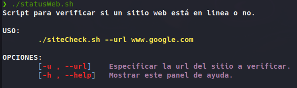

# statusWeb
<p align="center">
━━━━━┏┓━━━━━━━┏┓━━━━━━━━━━━━━┏┓┏┓┏┓━━━━┏┓━━
━━━━┏┛┗┓━━━━━┏┛┗┓━━━━━━━━━━━━┃┃┃┃┃┃━━━━┃┃━━
┏━━┓┗┓┏┛┏━━┓━┗┓┏┛┏┓┏┓┏━━┓━━━━┃┃┃┃┃┃┏━━┓┃┗━┓
┃━━┫━┃┃━┗━┓┃━━┃┃━┃┃┃┃┃━━┫━━━━┃┗┛┗┛┃┃┏┓┃┃┏┓┃
┣━━┃━┃┗┓┃┗┛┗┓━┃┗┓┃┗┛┃┣━━┃━━━━┗┓┏┓┏┛┃┃━┫┃┗┛┃
┗━━┛━┗━┛┗━━━┛━┗━┛┗━━┛┗━━┛━━━━━┗┛┗┛━┗━━┛┗━━┛
━━━━━━━━━━━━━━━━━━━━━━━━━━━━━━━━━━━━━━━━━━━
━━━━━━━━━━━━━━━━━━━━━━━━━━━━━━━━━━━━━━━━━━━
<br>
2 scripts hechos en Bash y Python, que tienen la misma función, la cual es saber si una URL Web está en línea.
</p>

## Script Bash
El script en bash cuenta con un menú de ayuda.

<p align="center">

</p>

### Uso script Bash
Para poder usar el script es necesario usar el parametro -u ó --url y despues pasar como argumento la URL del sitio web a revisar:

```bash
git clone https://github.com/m4lal0/statusWeb
chmod +x statusWeb.sh
./statusWeb.sh --url www.example.com
```

## Script Python
Para poder usar el script solo es necesario colocar como argumento la URL del sitio web a revisar:

```bash
python3 statusWeb.py www.example.com
```